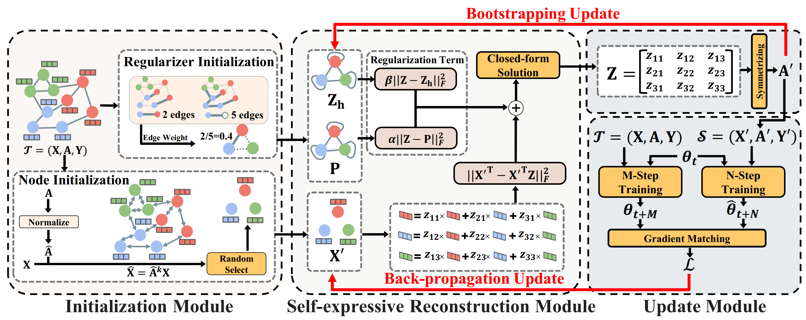

# Graph Data Condensation via Self-expressive Graph Structure Reconstruction (KDD 2024)

[KDD 2024] In this repository, we present the code of [Graph Data Condensation via Self-expressive Graph Structure Reconstruction](https://arxiv.org/abs/2403.07294) (GCSR).




## Data

For cora and citeseer, the code will directly download them using `PyG (PyTorch Geometric)`.
For reddit, flickr and ogbn-arxiv, we use the datasets provided by [GraphSAINT](https://github.com/GraphSAINT/GraphSAINT). They are available on [Google Drive link](https://drive.google.com/open?id=1zycmmDES39zVlbVCYs88JTJ1Wm5FbfLz) (`reddit`, `flickr` and `ogbn-arxiv`). Download and move them to `./data` at your root directory.

## Environment


```
python==3.7.13
torch==1.13.0
torchvision==0.14.0
torch_geometric==2.3.1
scikit_learn==1.0.2
scipy==1.7.3
numpy==1.21.6
ogb==1.3.6
deeprobust==0.2.8
torch_sparse==0.6.17
torch_scatter==2.1.1
```

## Reproducibility
The generated graphs are saved in the folder `./saved_ours`; you can directly load them to test the performance.

For Table 1, run `bash ./script/main_table.sh`.

It should be noted that, for each dataset and each condensation architecture, the training trajectory buffer should only be produced one time. E.g., for citeseer condensed by SGC, you just need to run the following command one time:
```bash
python buffer.py --dataset=citeseer --model=sgc2-lr3-wt54 --model_name=SGC2 --num_experts=100 --lr_teacher=1e-3
```

If you want to test the synthetic graph while condensing, add `--test` to each condensation command, e.g.:

```bash
python condense.py --test --gpu_id=0 --dataset=citeseer --expert_net=sgc2-lr3-wt54 --expert_net_type=SGC2 --test_net_type=GCN --epochs=1000 --eval_interval=200 --student_epochs=5 --max_start_epoch=60 --expert_epochs=2 --lr_feat=1e-6 --reduction_rate=0.5 --saved_folder=saved_ours --normalize --with_val --exps=5 --alpha=1 --beta=0.999 --tau=0.9 --gamma=0.5 --message_passing=4 --dropout_test=0.0
```

and add `--save` if you want to save your synthetic graphs. `student_epochs` denotes `N` in the paper and `expert_epochs` denotes `M` in the paper. Both of them are hyperparameters for multi-step gradient matching.

For Table 2, run `bash ./script/dif_test.sh`.

For Table 3, run `bash ./script/dif_condense.sh`.

For ablation study and Table 4, run `bash ./script/ablation.sh`.

## Citation

If you find this repo useful in your research, please consider citing our paper as follows:

```
@article{liu2024graph,
  title={Graph Data Condensation via Self-expressive Graph Structure Reconstruction},
  author={Liu, Zhanyu and Zeng, Chaolv and Zheng, Guanjie},
  journal={arXiv preprint arXiv:2403.07294},
  year={2024}
}
```
